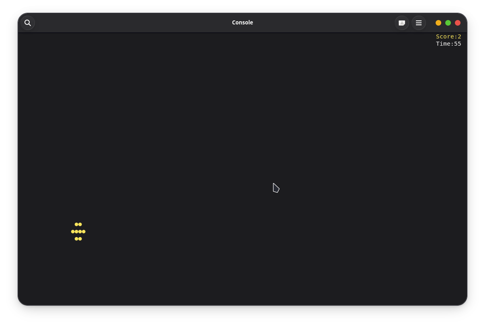
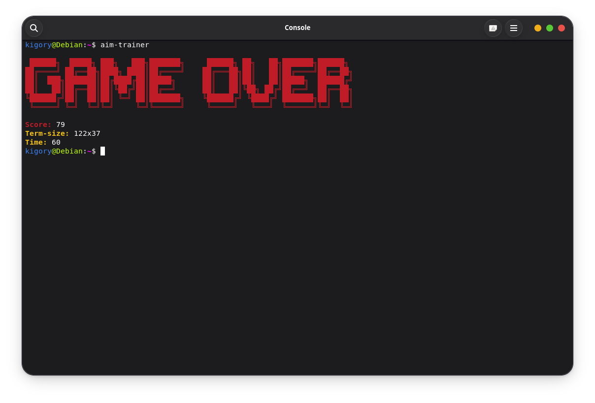

# cli-aim-trainer

just a little game that I want to attempt to make just for a learning experience

# Table Of Contents

- [cli aim trainer](#cli-aim-trainer)

- [Why?](#why)
- [Preview](#preview)

# Why?

Why not lol, this is my first project using golang and I wanted to make something simple and actually usable, so I decided to make an aim trainer in the terminal!
I had a lot of fun "testing" this project and actually building something this was a really fun game to build.

# Preview

this is how the experience should normally work
running `aim-trainer` will start the game and then you could click on the circles using your mouse.
you have a default time of 60 seconds but you can change that using the `--time <duration>` flag

as you can see there is the score and the time on the left and a yellow circle you need to click on to make your score go up!

**_this is is basicaly the whole game lol_**

at when the time reaches 0 or you press q (quit the game) there will be an overview showing you you'r score

as you can see it shows me three things/stats:
my score
my terminal scale (the smaller a terminal window is the easier)
my the time (this is the time I chose when using the --time flag to 60s is the default)

---

### easter-egg (somewhat?)

your score has three colors red, yellow and green.
Here is what they mean:

**red = trash**

**yellow = average**

**green = pro**

  
